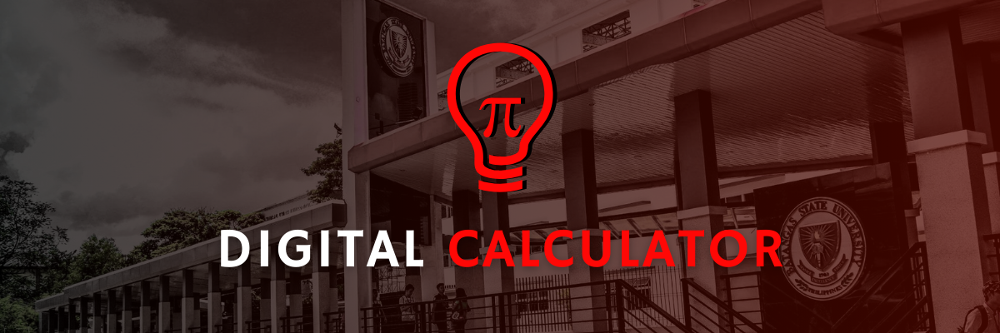
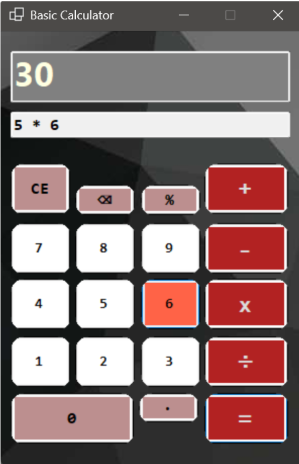
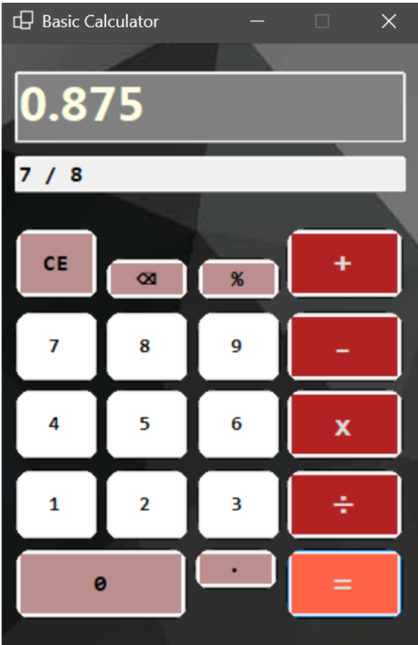
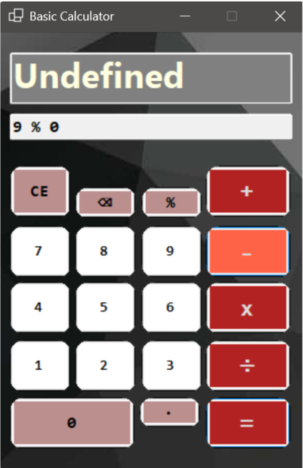

   

# DIGITAL CALCULATOR 🧮💻
Welcome to the **Digital Calculator Repository** — where math meets design and every click counts! Built with the power of **C# and Windows Forms**, this calculator isn't just about numbers, as it's about making everyday calculations feel smooth, sharp, and surprisingly fun.

From quick sums to tricky equations, this stylish desktop tool handles it all with a clean, interactive interface and the magic of object-oriented programming behind the scenes. No more clunky buttons or boring consoles — just a smart, sleek calculator that looks as good as it computes.

**Add it. Subtract it. Multiply. Divide.**
Whatever the math, this app’s got your back — one click at a time. 🎯💡
 
 

## 🔢 Overview of Contents
➗ [**1. Project Overview**](#proj_overview)  
➗ [**2. Sample Output**](#proj_output)   
➗ [**3. Project Developer**](#proj_developer)  
➗ [**4. Acknowledgement**](#proj_acknowledge) 
 

## <a id = "proj_overview"> 🔢 Project Overview </a> 
This application provides a basic digital calculator interface that replicates standard calculator functionality using **C# and Windows Forms Application (WFA)**. It features a fixed-size, aesthetically pleasing form with buttons for input, operations, and result display. Developed with object-oriented programming in mind, the project emphasizes clean design, responsive layout, and seamless interaction between controls — showcasing the practical use of C# in building desktop **GUI applications.** ➕➖✖️➗

## 🌟 Main Features

### 1. Graphical User Interface (GUI) Design
- Centralized form display (`StartPosition: CenterScreen`)
- Fixed single border style for clean layout
- Aesthetic flexibility for fonts, sizes, colors, and button styling

### 2. Numeric and Decimal Input
- Buttons for digits `0-9` (`btn0` to `btn9`)
- Decimal point button (`btnPoint`) for floating-point numbers

### 3. Arithmetic Operations
- **Addition** (`btnAdd`)
- **Subtraction** (`btnMinus`)
- **Multiplication** (`btnMultiply`)
- **Division** (`btnDivide`)
- **Equals** button (`btnEqual`) to compute results

### 4. Input and Memory Management
- **Clear Entry (CE)** (`btnCE`) – clears current input
- **Clear All (C)** (`btnClear`) – resets the entire input and calculation

---

## <a id = "proj_output"> 🔢 Sample Output </a> 
This section shows what the calculator looks like when it's running. You'll see the form with buttons for numbers, arithmetic operations, and a display area where the result appears. It gives you a clear idea of how the app works and what users will see when they use it.

<table>
  <tr>
    <td align="center"></td>
    <td align="center"></td>
    <td align="center"></td>
  </tr>
  <tr>
    <td align="center"></td>
    <td align="center"></td>
    <td align="center"></td>
  </tr>
</table>

---

> *The image above shows the functional layout of the calculator, including the numeric keypad, operation buttons, and result display — all built with Windows Forms in C#.*

## <a id = "proj_developer"> 🔢 Project Developer </a> 
### 🌟Meet the Developers🌟

   

---

The **Digital Calculator** project was developed by second-year Computer Science students from Batangas State University - The National Engineering University (BatStateU-TNEU), Alangilan Campus,  of class **CS-2201**, as part of the **CS222 - Advanced Object-Oriented Programming** course. The goal was to apply object-oriented programming principles and file handling techniques in creating a Digital Diary application, transforming theoretical concepts into a practical, functional software solution.

For further information or inquiries, below are the contact details of the developers:
| **Name**            | **Gmail**                | **GitHub**               |
|---------------------|--------------------------|--------------------------|
| **De Castro, Angel Lyka Mae**    | 23-09904@g.batstate-u.edu.ph     | [GitHub Profile](https://github.com/Decastro122604) |
| **Crisostomo, Erix Steven**    | 23-01893@g.batstate-u.edu.ph     | [GitHub Profile](https://github.com/developer2) |
| **Nunez, Nigel Hans**    | 23-07848@g.batstate-u.edu.ph    | [GitHub Profile](https://github.com/NigelHans) |
| **Vael, Anthonina Dhapniella C.**   | 23-04485@g.batstate-u.edu.ph     | [GitHub Profile](https://github.com/andavael) |
 

## <a id = "proj_acknowledge"> 🔢 Acknowledgement </a> 
We, the developers of this project, would like to extend our deepest thanks to our mentor in **CS222 – Advanced Object-Oriented Programming, Ms. Fatima Marie P. Agdon.**

This Digital Calculator is more than just a product of code — it's the result of her unwavering support, insightful guidance, and tireless dedication. Through every concept explained, every challenge encouraged, and every lesson shared, Ms. Agdon helped us not only understand the intricacies of object-oriented programming and file handling, but also inspired us to build with purpose and creativity.

Her patience, passion for teaching, and belief in our potential were the driving forces behind this accomplishment. 

**Thank you, Ma’am Fatima,** for being more than just a mentor — thank you for being our compass in this journey of learning and growth. We are truly grateful. 💻✨
 
